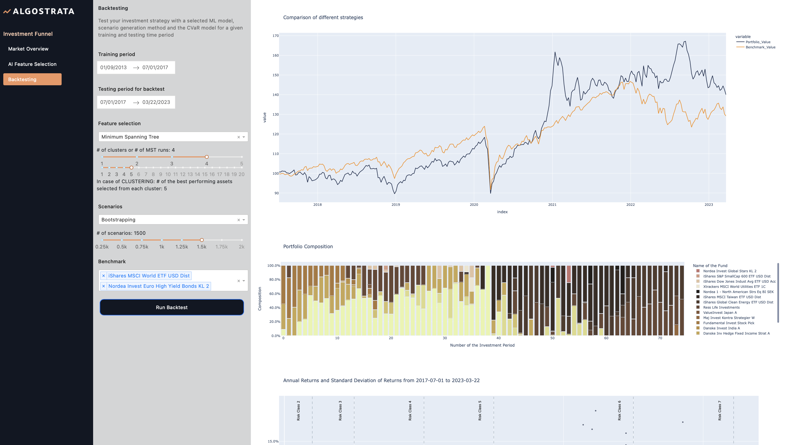

<p>
  </a>
</p>

<p align="center">


</p>

Welcome to our open-source project for developing and backtesting investment strategies.

Having been utilized by over 500 students from Asset Allocation classes at Copenhagen University and Danish Technical 
University, this project is also a pivotal tool for amateur/beginner quants. 

The primary goal of this project is to provide a better overview of the ETF/Mutual fund market and to allow users to
experiment with various investment techniques and algorithms. Ultimately, it offers a platform to backtest and refine investment strategies.

<!-- toc -->
- [Technologies and Models](#technologies-and-models)
  * [Portfolio optimization models](#portfolio-optimization-models)
  * [ML models](#ml-models)
  * [Scenario generation algorithms](#scenario-generation-algorithms)
- [How to start in 3 steps](#how-to-start-in-3-steps)
- [Usage](#usage)
  * [Market Overview](#market-overview)
  * [AI Feature Selection](#ai-feature-selection)
  * [Backtesting](#backtesting)
  * [Develop your own model](#develop-your-own-model)
- [Further configuration for professionals or students](#further-configuration-for-professionals-or-students)
- [Authors of the project](#authors-of-the-project)
- [Research related to Investment Funnel](#research-related-to-investment-funnel)
- [Contributing](#contributing)
- [Versioning](#versioning)
- [License](#license)
<!-- tocstop -->

# Technologies and Models
The Investment Funnel brings together various optimization models for asset allocation, machine learning (ML) 
methodologies for feature selection, and algorithms for scenario generation. Coupled with the backtesting 
framework and Dash application, it presents a comprehensive environment for the development and backtesting of 
investment strategies

#### Portfolio optimization models
1. Conditional Value at Risk (CVaR) model - [read more](https://docs.mosek.com/portfolio-cookbook/riskmeasures.html#conditional-value-at-risk)
2. Mean-Variance (Markowitz) model - [read more](https://docs.mosek.com/portfolio-cookbook/markowitz.html)

#### ML models
1. Minimum Spanning Tree (MST) model - [read more](https://en.wikipedia.org/wiki/Minimum_spanning_tree)
2. Hierarchical Clustering (HCA) model - [read more](https://en.wikipedia.org/wiki/Hierarchical_clustering)

#### Scenario generation algorithms
1. Monte Carlo scenario simulation - [read more](https://en.wikipedia.org/wiki/Monte_Carlo_method)
2. Bootstrap scenario simulation - [read more](https://en.wikipedia.org/wiki/Bootstrapping_(statistics))

To further enhance your knowledge on mathematical optimization in finance, we highly recommend the [MOSEK Portfolio Optimization Cookbook](https://github.com/MOSEK/PortfolioOptimization).
# How to start in 3 steps
STEP 1: create and activate python virtual environment
``` bash
python -m venv venv
source venv/bin/activate
```

STEP 2: install requirements
``` bash
pip install -r requirements.txt
```
STEP 3: run dash application
``` bash
python app.py 
```
The app is running on http://127.0.0.1:8050

# Usage
Investment Funnel contains multiple portfolio optimization models, machine learning methods and algorithms located in 
[models folder](models). <br/>

Furthermore, this project contains dash application for visualizing the data, output of ML methods as well as results from backtesting. 
You can explore the dash application by running [app.py](app.py) file. <br/>

### Market Overview
On the first page of our Dash application, you'll find an overview of the performance of the ETF/Mutual fund market 
in terms of risk and returns. This can provide a clearer understanding of the data included in the project.

Moreover, you have the option to search and select one or more assets for a comparison against the entire 
universe of assets. For even deeper insight, you can repeat this experiment for various time periods.

<p>
  </a>
</p>

### AI Feature Selection
An integral part of optimal portfolio allocation involves feature selection. In this regard, we've implemented 
two machine learning methods, Minimum Spanning Tree and Hierarchical Clustering, to streamline the number of assets 
needed for the optimization model. 

To gain a deeper understanding of these two ML models, you're afforded the opportunity to experiment with their 
configurations and visualize the outcomes in interactive graphs. This empowers you to delve into which assets were
selected, and scrutinize the performance, specifically the risk and returns, of the selected assets over a given time period.

<p>
  </a>
</p>

### Backtesting
Backtesting is arguably the most crucial aspect of this project. It allows you to test your investment strategies 
on historical data and compare their performance with other models.

You have the flexibility to select your own train (out-of-sample) and test (in-sample) periods. You can choose 
an optimization portfolio allocation model as well as a machine learning model for feature selection - this helps
optimize the number of assets for your model. 

Further customization can be achieved by specifying your machine learning model's configurations and the algorithm 
for scenario generation. And lastly, you have the option to select the benchmark for comparison.

Once your backtest run completes, you will be presented with a comparative view of your optimal portfolio's performance
against this benchmark for the test period. 
<p>
  </a>
</p>

This performance review will offer insights into portfolio value development, allocation to individual assets for
each investment period, as well as comparisons in terms of average annual return, standard deviation, and Sharpe ratio.

<p>
  </a>
</p>


### Develop and test your own model
Lastly, you have the option to develop your own optimization and machine learning models for portfolio allocation or
feature selection, and seamlessly integrate those into the investment funnel. By utilizing our Dash application,
you can leverage the backtesting framework to visualize your model's results and conveniently compare its performance 
against those of existing models in this repository.

# Further configuration for professionals or students
Are you intrigued by the Investment Funnel project? Do you wish to utilize it for your own research, teaching, 
or the development of investment strategies?

To make the best of this project, you'll likely need access to up-to-date financial data and a professional solver.

* For the data, please reach out to Kourosh Rasmussen from [AlgoStrata](https://algostrata.com/about-us) or [Petr Vanek](https://www.linkedin.com/in/vanekpetr42/). They can guide you through the next steps.
* As for the solver, we recommend using [MOSEK](https://www.mosek.com/). It's free for the first 30 days and fosters many academic collaborations.

## Authors of the project

* **Petr Vanek** - *Co-founder & Initial work* - [VanekPetr](https://github.com/VanekPetr)
* **Kourosh Rasmussen** - *Co-founder* - [AlgoStrata](https://algostrata.com) & [Penly](https://penly.dk)
* **Gábor Balló** - *Implementation of CVaR model with CVXPY and MOSEK* - [szelidvihar](https://github.com/szelidvihar) & [MOSEK](https://github.com/MOSEK)
* **Auður Anna Jónsdóttir** - *Initial work for MST and Hierarchical Clustering*
* **Chanyu Yang** - *First contributor to our dash application* - [cicadaa](https://github.com/cicadaa)
* **Alexandra Mourier** - *Design of our GitHub README banner* 

## Research related to Investment Funnel
* **Arnar Tjörvi Charlesson & Thorvaldur Ingi Ingimundarson** - *Self-Organizing Maps and Strategic Fund Selection* (Master Thesis, DTU, 2023)
* **Dimosthenis Karafylias** - *Deep Reinforcement Learning For Portfolio Optimisation* (Master Thesis, DTU, 2022)
* **Carlos Daniel Pinho Ventura** - *Designing Hybrid Investment Packages of Cryptocurrencies with Rewards and Index Funds* (Master Thesis, DTU, 2022)
* **Peter Emil Dinic Holmsø** - *Optimal Life Cycle Planning using Stochastic Simulation* (Master Thesis, DTU, 2021)
* **Alexandros Giannakakis & Rasmus Jensen** *AI-Based Portfolio Analysis and Risk Management of Index Funds and Cryptocurrencies* (Master Thesis, DTU, 2021)
* **Idriss El Quassimi** *Graph Theoretical Methods in Strategic Asset Allocation* (Master Thesis, DTU, 2021)
* **Jorge Bertomeu Genís** *Portfolio Optimization using Index Funds and a Basket of Cryptocurrencies* (Master Thesis, DTU, 2021)
* **Andrias Poulsen** - *Performance Analysis of Sustainable Investment Portfolios* (Bachelor Thesis, DTU, 2021)
* **Auður Anna Jónsdóttir** - *Feature Selection in Asset Allocation* (Master Thesis, DTU, 2020)
* **Petr Vanek** - *Performance Analysis of the most traded Mutual Funds versus Optimal Portfolios of Exchange Traded Funds* (Master Thesis, KU, 2020)

Do you want to write your thesis on Investment Funnel? Please reach out and let us know.

## Contributing
Thank you for considering contributing to this project! We welcome contributions from everyone. Before getting started, please take a moment to review our [Contribution Guidelines](CONTRIBUTING.md).

## Versioning

We use [SemVer](http://semver.org/) for versioning. For the versions available, see the [tags on this repository](https://github.com/VanekPetr/investment-funnel/tags). 

## License

This repository is licensed under [MIT](LICENSE) (c) 2023 GitHub, Inc.

<div align='center'>
<a href='https://github.com/vanekpetr/investment-funnel/releases'>

</a>
<a href='https://github.com/vanekpetr/investment-funnel/blob/main/LICENSE'>

</a>
</div>
