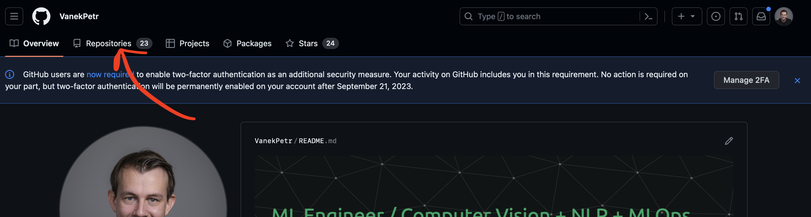
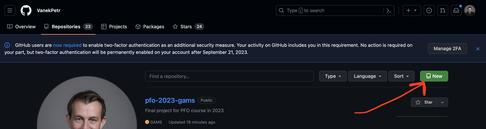
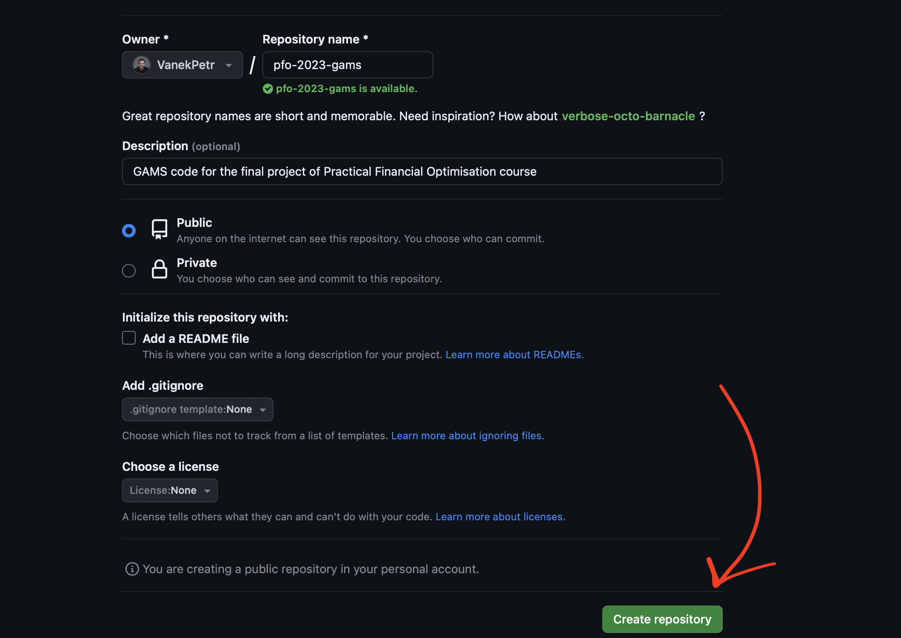
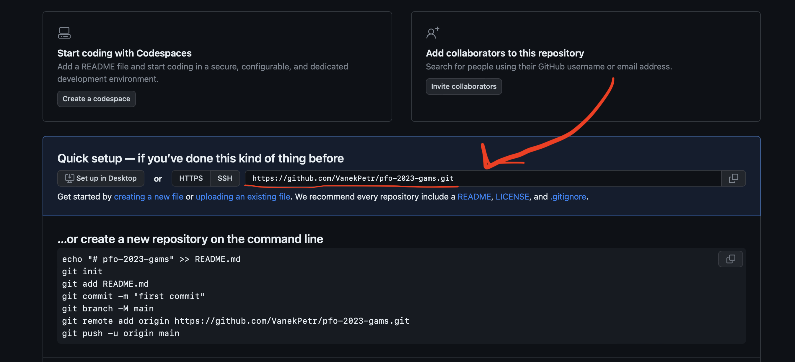

# How to save your GAMS code

Dear students 🧑‍🎓,

to save your GAMS code on GitHub, you need to follow these steps:

### 1, Create a new repository
First:
<p>
  </a>
</p>
Second:
<p>
  </a>
</p>

### 2, Define your repository
<p>
  </a>
</p>

### 3, Clone your repository
On your computer, navigate to a folder where you want to save your project:

```bash
cd Documents/code
```

Copy the link from GitHub:
<p>
  </a>
</p>

Clone the project:

```bash
git clone copied_link
```

### 4, Save your code to GitHub
#### 4.1 Navigate to a folder with the cloned repository:

```bash
cd Documents/code/your_project_name
```
or

```bash
cd your_project_name
```

#### 4.2 Copy all GAMS files to this folder
#### 4.3 Add all files to the git

```bash
git add .
```

#### 4.4 Commit the changes

```bash
git commit -m "your message"
```

#### 4.5 Push the changes to GitHub

```bash
git push origin main
```
